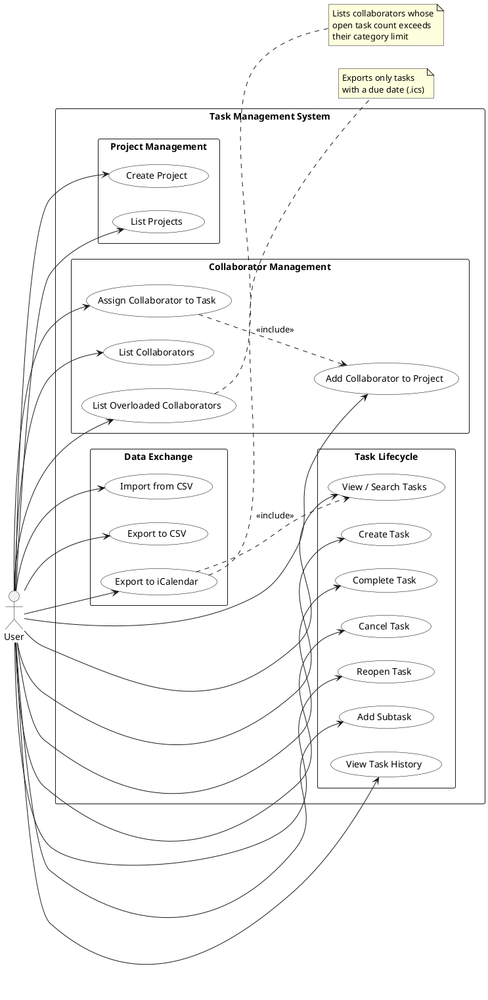
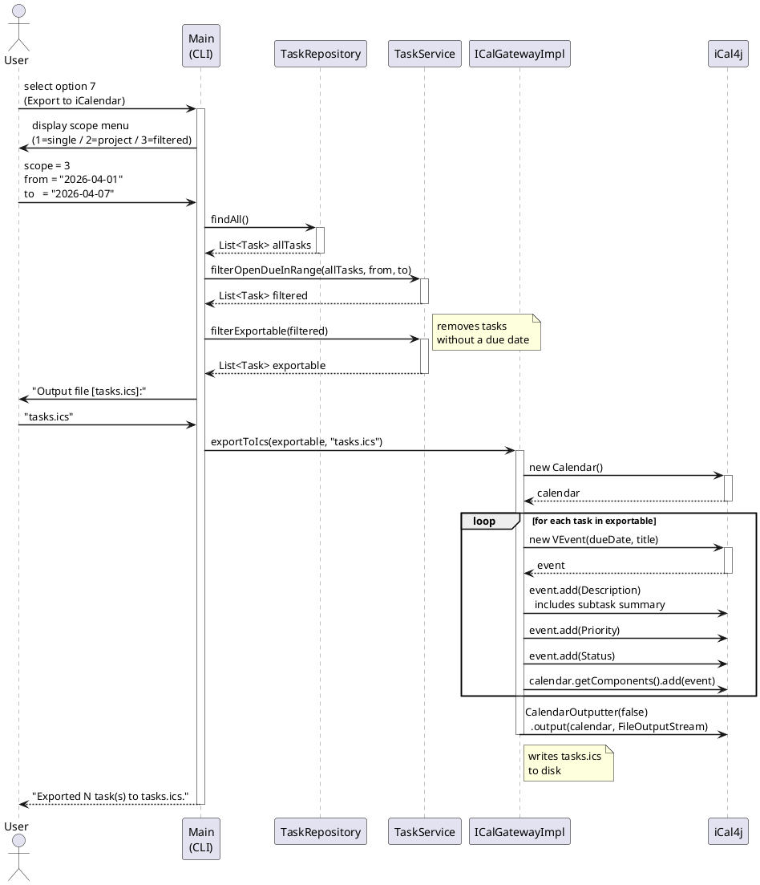

# Iteration III — Diagram Blueprints (PlantUML)

Copy each code block and paste it directly into https://www.plantuml.com/plantuml/uml/
(or use the PlantUML VS Code extension, or the desktop JAR).
Export as PNG/SVG for submission.

---

## 1. Updated Use-Case Diagram

---

## 2. Updated UML Class Diagram

```plantuml
@startuml
skinparam classAttributeIconSize 0
skinparam linetype ortho

package "taskmanager.domain" {

  class Task {
    - id : int
    - title : String
    - description : String
    - creationDate : String
    - dueDate : String
    - priority : Priority
    - status : Status
    - recurrence : Recurrence
    --
    + hasDueDate() : boolean
    + getSubtasks() : List<Subtask>
    + getTags() : List<String>
  }

  class Subtask {
    - id : int
    - title : String
    - status : Status
    - parentTaskId : int
  }

  class Project {
    - id : int
    - name : String
    - description : String
  }

  class Collaborator {
    - id : int
    - name : String
    - category : CollaboratorCategory
    - projectId : int
  }

  enum CollaboratorCategory {
    JUNIOR
    INTERMEDIATE
    SENIOR
    --
    + getOpenTaskLimit() : int
  }

  enum Priority {
    LOW
    MEDIUM
    HIGH
  }

  enum Status {
    OPEN
    COMPLETED
    CANCELLED
  }

  enum Recurrence {
    NONE
    DAILY
    WEEKLY
    MONTHLY
  }

  class TaskService {
    + validateAddSubtask(parent : Task) : void
    + validateNewTaskWithoutDueDate(all : List<Task>, t : Task) : void
    + validateAssignCollaborator(c : Collaborator, tasks : List<Task>) : void
    + filterExportable(tasks : List<Task>) : List<Task>
    + filterOpenDueInRange(tasks : List<Task>, from : String, to : String) : List<Task>
  }

  class CollaboratorService {
    + findOverloaded(collaborators : List<Collaborator>, allTasks : List<Task>) : List<CollaboratorLoad>
  }

  class "CollaboratorService::CollaboratorLoad" as CollaboratorLoad {
    + collaborator : Collaborator
    + openCount : int
  }

  Task "1" *-- "0..20" Subtask : contains >
  Task "0..*" --> "0..1" Project : belongs to >
  Task "0..*" --> "0..1" Collaborator : assigned to >
  Collaborator "0..*" --> "1" Project : defined under >
  Collaborator --> CollaboratorCategory
  CollaboratorService --> CollaboratorLoad : produces
}

package "taskmanager.persistence" {

  class Database {
    - {static} connection : Connection
    + {static} getConnection() : Connection
    + {static} close() : void
  }

  class TaskRepository {
    + save(t : Task) : Task
    + findAll() : List<Task>
    + findByProject(projectId : int) : List<Task>
    + findByCollaborator(collaboratorId : int) : List<Task>
    + findById(id : int) : Optional<Task>
    + search(keyword : String) : List<Task>
  }

  class ProjectRepository {
    + save(p : Project) : Project
    + findByName(name : String) : Optional<Project>
    + findById(id : int) : Optional<Project>
    + findAll() : List<Project>
  }

  class CollaboratorRepository {
    + save(c : Collaborator) : Collaborator
    + findById(id : int) : Optional<Collaborator>
    + findAll() : List<Collaborator>
    + findByProjectId(projectId : int) : List<Collaborator>
  }

  class SubtaskRepository {
    + save(s : Subtask) : Subtask
    + findByTaskId(taskId : int) : List<Subtask>
  }

  TaskRepository --> Database : uses >
  ProjectRepository --> Database : uses >
  CollaboratorRepository --> Database : uses >
  SubtaskRepository --> Database : uses >

  TaskRepository --> ProjectRepository : uses >
  TaskRepository --> CollaboratorRepository : uses >
  TaskRepository --> SubtaskRepository : uses >
}

package "taskmanager.ical" {

  interface ICalGateway {
    + exportToIcs(tasks : List<Task>, filePath : String) : void
  }

  class ICalGatewayImpl {
    - buildDescription(task : Task) : String
    - mapPriority(task : Task) : int
    - mapStatus(task : Task) : Status
    + exportToIcs(tasks : List<Task>, filePath : String) : void
  }

  class "iCal4j\n(external library)" as ical4j <<external>> {
    Calendar
    VEvent
    CalendarOutputter
  }

  ICalGatewayImpl ..|> ICalGateway
  ICalGatewayImpl ..> ical4j : <<uses>>
}

package "taskmanager.app" {

  class Main <<boundary>> {
    - taskRepo : TaskRepository
    - projectRepo : ProjectRepository
    - collabRepo : CollaboratorRepository
    - subtaskRepo : SubtaskRepository
    - taskService : TaskService
    - collabService : CollaboratorService
    - icalGateway : ICalGateway
    --
    + {static} main(args : String[]) : void
  }

  Main --> TaskRepository
  Main --> ProjectRepository
  Main --> CollaboratorRepository
  Main --> SubtaskRepository
  Main --> TaskService
  Main --> CollaboratorService
  Main --> ICalGateway
}

@enduml
```

---

## 3. Sequence Diagram — Export Filtered Tasks to iCalendar

**Scenario:** User picks option 7, chooses scope "3" (filtered — open tasks
due this week), enters a date range, and exports to `tasks.ics`.

---

## Tips for submission

- Paste each block (including `@startuml` / `@enduml`) into https://www.plantuml.com/plantuml/uml/
- Export as **PNG** (or SVG for higher quality)
- Save the PNGs inside `Iteration3/` alongside the code
- Suggested filenames:
  - `Iteration3/use-case-diagram.png`
  - `Iteration3/class-diagram.png`
  - `Iteration3/sequence-diagram-ical-export.png`

## Key change reflected vs. earlier blueprint

The `Collaborator` class now has `projectId : int` and an explicit association
`Collaborator "0..*" --> "1" Project : defined under` — this reflects the fix
that made collaborators project-scoped per the spec.
